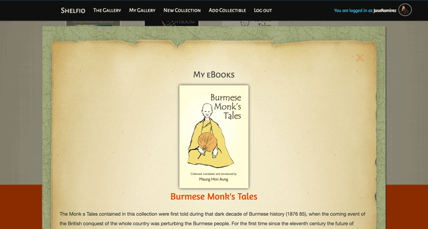
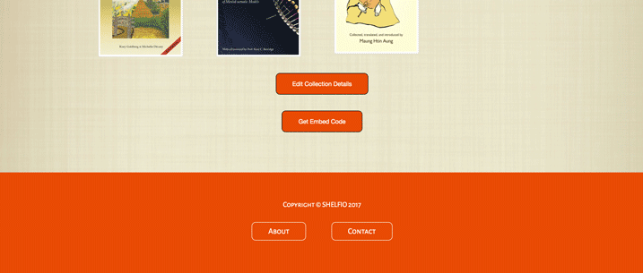
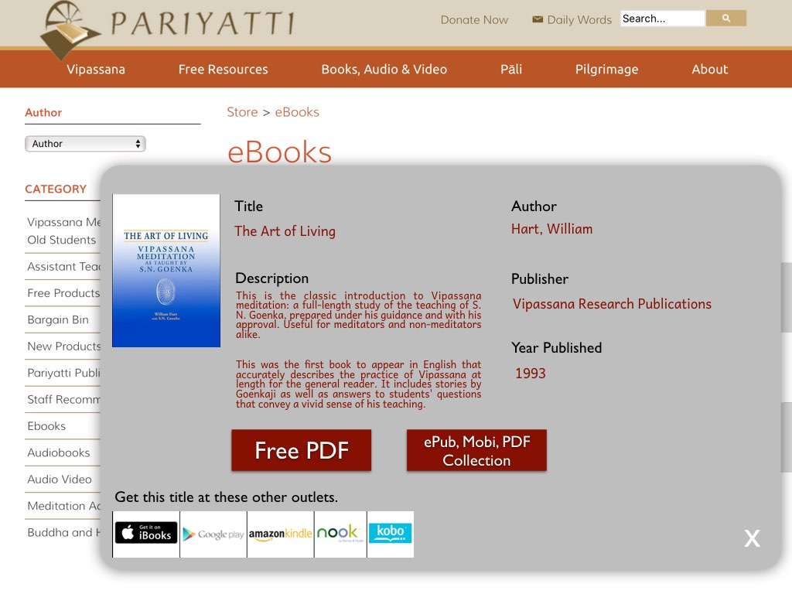
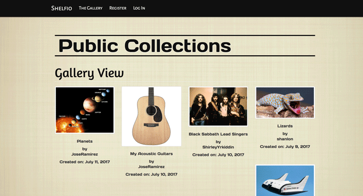

Updated 7-12-2017

### Capstone Proposal 2017 by Steve Hanlon

# Shelfio
###### Alternative product name list
- Capsule Collect
- Time Capsule
- Clickable Collectibles
- Pack Rat
- Collect-N-spect
- Shelfio or sHelpio
- Amphora
- Decluttero

### Product Overview

- Create <strong>Custom Collections</strong> to showcase comic books, book collections, music collections, stamps, coins, pictures, videos or even data collections!  Share any Collection using a direct link to that stored Collection or embed it in another webpage.

<strong><a name="samp1">Opening Screen to create a new collection or view other collections already created</a></strong>

sample picture 1

Updated 7-12-2017----->
Logged In - Nav bar changes

All My Collections represented with its own page
and each collection represented by an image

  

- The user creates a Collection's <em>Presentation Window</em> using form fields to enter details about the Collection as well as uploading an "ID" icon connected to a <em>Collectible item</em>.  This <em>Presentation Window</em> will show up as a <em>Modal Window</em> in the browser after the Collectible ID image icon is clicked.

<strong><a name="samp2">Sample proposed UI to build modal Presentation Window template<</a>/strong>

sample picture 2

<strong><a name="samp3">Here is a sample form template built by a user to enter data and represent the layout in the Modal Window. Click <em>Save Layout</em> button to Save this layout to the Collection.</a></strong>

sample picture 3

Updated 7-12-2017----->
Updated MVP Collection Form

  

- <strong>Each Collectible</strong> is represented by a picture ID icon (uploaded by the user) and this icon, inserted in a <em>Styled Background</em> Collection area (see sample picture 6 - e.g. a bookshelf for a book collection, a stamp book for stamp collection, etc.) will act as the link to open the Modal Presentation Window revealing the Collectible's details entered in the form.

<strong><a name="samp4">A sample template using an example of an eBook collection.  After filling out the form and attaching links to the buttons and docs/images, the user clicks "Add to Collection."  
To add or remove form fields/buttons, the user can click the "Edit Layout" arriving back at the editing screen.</a></strong>

sample picture 4

Updated 7-12-2017-----> Add a Collectible Form

<strong><a name="samp5">Collectible Added to <em>eBook Collection</em>.  Continue to enter in more Collectibles or use Menu icon in upper corner to view the <em>eBook Collection</em>, go to other collections or to Home Page.</a></strong>

sample picture 5

Updated 7-12-2017-----> Collectible Added page

<strong><a name="samp6">View the Collection (e.g. eBook Collection)</a></strong>

sample picture 6

Updated 7-12-2017-----> View the Collection (e.g. Acoustic Guitar Collection and eBooks Collection)

  

- <strong><a name="samp7">When a picture icon is clicked, Presentation Modal Window opens to display details, linked buttons and related sites.</a></strong>

sample picture 7

Updated 7-12-2017-----> Presentation Modal Window (e.g. single Acoustic Guitar info)

eBook Modal Window Sample:

Arrow at bottom of Collectible allows for Editing, Adding Another Collectible or Viewing the Collection.

  

- <strong><a name="samp8">When the buttons at bottom of a Collection are clicked, they allow this Collection's webpage to be shared or embedded in other websites.</a>

sample picture 8

Updated 7-12-2017-----> Collection Buttons using eBook Collection (embed, edit)

Embed code (iframe tag at bottom) to show this Collection view at another website 
  

- <strong><a name="samp9">Share the embed link to this Collection for others to view this webpage or copy the embed code (example below) to display the collection with <em>Styled Background</em> in any webpage.

<strong>Embed code allows this Collection to show up on another website</a></strong>

sample picture 9

 
<strong><a name="samp10">Same <em>Presentation Window</em> functionality when an icon is clicked.</a></strong>

sample picture 10

<strong>Note: This Embed feature will work once Shelfio is deployed. MVP does not include this.</strong>
  

- <strong>Public Collections View</strong>

<strong>The public (i.e. not logged in or registered) or anonymous users can view all of the Collections that are set to "Public" status.  This setting is chosen when filling out the New Collection Form</strong>

sample picture 9

  

### Site Tree and Specific Functionality

<strong>Website Tree</strong> (separate webpages bolded and linked to pictures)
- <strong>[Home Page](#samp1)</strong> <em>(sample picture 1)</em> with Simple Full-screen layout
  - single "Get Going" button that redirects to Log-in page (or Registration page from Log-in) and if logged in, directs to "New Collection" webpage.
  

  Log-in page

  

  Registration page
  
  

  -<strong>Create a Collection</strong> 
  Once logged in, create a collection and Save it.
  

  -<strong>Collection view (no collectibles yet)</strong> 
  

  - <strong>[Collectible Saved to Collection](#samp4) </strong>webpage
  

  - <strong>[Clicked on Collectible](#samp4) </strong>to view modal window info
  pertaining to that collectible
  

  - View all your saved collections

  

  - <strong>[Collection](#samp6) "shelf" webpage</strong> with clickable Collectible icons as well as Share and Embed buttons
        - Icon click shows [Presentation Window](#samp7) revealing a collectible's details. Close this window by clicking "X".
        - [Share button](#samp8) copies webpage URL to clipboard and shows message "Collection link copied to clipboard"
        - [Embed button](#samp8) copies script embed code to clipboard then shows message "Collection embed code copied to clipboard"

### Frontend vs. Background activity
If there is any actions your app needs to take in the background describe _each_ of them and how they change the underlying data your app saves.

- Home Page ['Create a Collection'](#samp1) button when clicked
  1. open a prompt to ask the user to name the new Collection
  2. backend creates a new HTML file and names it the same (from given "blank" HTML template with pre-made <form> nodes)

- Starting off Building a Collection [<em>form/Presentation Window</em>](#samp2),
  1. as the form is being built, HTML input nodes are being appended to the form). ****Maybe Pre-built form will be better to start with.
  2. The <em>Save Layout</em> button saves the Collection's HTML file.

- [Add to Collection button](#samp2) takes the Collectible's form data and stores it as an key/value pair in an array/list.  The picture ID icon is stored in an image folder.

- Share/Embed buttons code copied to clipboard and

### MVP
**Pick the minimum feature set for your product to work.**
- Create User Accounts
- Allow User to create custom collections
- Allow User to add Collectibles (with details about the collectible) to those collections
- Give ability to share these collections with others
- Allow ability to embed a collection in another webpage

##### Models
- <strong>User</strong>: to open an account
- <strong>Categories</strong>: to classify collections
- <strong>Collection</strong>: to store collectibles
- <strong>Collectible</strong>: to store interesting details about a collectible
- <strong>Links</strong>: to add more detail to a Collectible

##### Templates
- [Home HTML](https://startbootstrap.com/template-overviews/the-big-picture/)
- [Collectible Form HTML (Editing Presentation Window)](#samp5)
- [Single Collection Gallery (with Presentation Modal Window)](images/eBook_collection1_update1.png)
- [All Collections Gallery for a single user](images/Gallery_My_Collections1.png)
- [Public Collections Gallery of all Users](images/public_collections1_view.png)
- Accounts
  - Registration form
  - Log in form
  - Update Profile and password forms
- About webpage
- Contact form webpage

### Data Model

What are the persistent "nouns" you need to save across pages in your project MVP?
What do they represent?

- [Collection](#samp6) ------> Collection Sets (e.g. books,
  stamps, DVDs, music,)
- [collectible (item)](#samp4) ---------> A single item in a Collection
- User Accounts
- uploaded media for collections, collectibles, account profile image
- form data pertinent to collections, collectibles, user profile

### Category
- name (allows for user to make sub-categories expanding on "type" in Collection model

### Collection
- owner (Foreign Key)
- image (user upload)
- name of Collection (e.g. My Paintings from the 70's)
- type of Collection (e.g. visual art - oil on canvas)
- categories (Many to many relationship) (e.g. Jazz, classical)
- created (date)
- status (private or public)

### Collectible/Item
- photo ID/cover art (user upload)
- name
- description
- Author/Composer or Creator
- Artist
- Publisher
- Year Published
- Copyright year
- serial number
- classification (Many to Many Relationship)
- date created
- date last saved

### Link
- name
- link
- collectible (Foreign Key)

### Technical Components

- form submission using Django built-ins
- image uploads using Django helper functions and Media storage
- jQuery to provide modal windows for Collectibles
- jQuery to allow for Hide/Show for collectible UI
- Bootstrap to help with form presentation and overall website base appearance.

### Schedule

1. Write Django Classes
2. Write basic view functions
3. Establish base template style and look
4. work on Collection form (view and template)
5. work on Collectible form (view and template)
6. implement jQuery modal window and style window for collection view when clicking on a Collectible
7. establish accounts app for user registration, log-in and profiles
8. continually adjust CSS to make site uniform and understandable
9. Add edit ability to collectibles and collections
10. Add Django Formset to Collectible form to enable web links and downloads for a Collectible
11. test out multiple user accounts with multiple collections
12. work on website click routing to make sure those without an account get directed to Reg. page or those logged-out get routed to a Log-in.  After log-in route to collection gallery, etc.
13. customize Nav bar with conditional statements in template to help out routing and signal when someone is signed in
14. Add embed feature by providing a link accessed through jQuery.  (** Need to deploy to test out this feature on other sites.)

### Further Work

- Add dropdown on Collection form for sub-categories of collections with specific fields relevant to common collectibles (books, instruments, stamps, comics, etc.).  This can help remove irrelevant fields and blank fields.

- Make Gallery pictures uniform through a module to auto-size pics in Collection gallery but not alter or distort picture that shows in Collectible view

- Fix EDIT-ADD to only work for a User's collectibles not with another user's collectibles (i.e. I shouldn't be able to edit someone else's collectible)

- Add + symbol to Categories when creating a New Collection to create Categories on-the-fly (?????)

- Add placeholders to Link Model for URL fields (started this)

- Get Profile update and password reset to work

- Make Contact page post (send via email)

- Drag and Drop with Sortable to allow user to shift collections and collectibles around in the Gallery (http://rubaxa.githwub.io/Sortable/)

- Make Modal Window have a photo carousel for extra photos (or thumbnails)

- Add ability to add audio, video players, slideshows
    - Consider ability to upload audio and show as HTML5 audio player

- Add API to use computer's camera to take User Registration profile pic
https://www.html5rocks.com/en/tutorials/getusermedia/intro/#toc-gettingstarted

- Incorporate search engine (search field on template to locate all Collections about 'cats' or 'musical instruments')

## Submission

[Shelfio at Github](https://github.com/SixStringsCoder/Shelfio)

[Read Me](https://github.com/SixStringsCoder/Shelfio/blob/master/ReadMe.md)

[Proposal](https://github.com/SixStringsCoder/Shelfio/blob/master/docs/proposal.md)

Email me the URL to your capstone repo on GitHub before the proposal is due.

### Brainstorming Area
