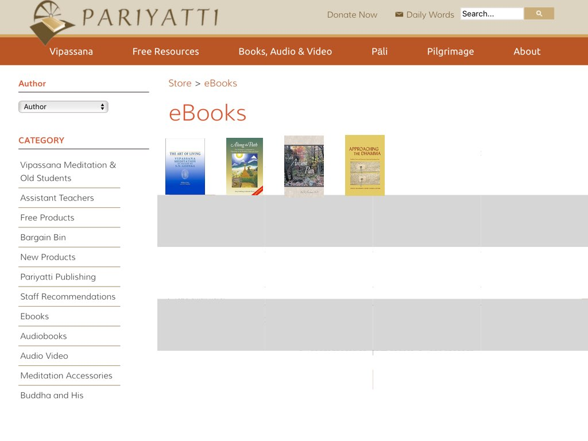

### Capstone Proposal 2017 by Steve Hanlon

# Custom Collections
###### Alternative product name list
- Clickable Collectibles
- Here's My Case
- Love Set Match
- Pack Rat
- Collect-N-spect

### Product Overview

- Create <strong>Custom Collections</strong> to showcase comic books, book collections, music collections, stamps, coins, pictures, videos or even data collections!  Share any Collection using a direct link to that stored Collection or embed it in another webpage.

<strong>Opening Screen to create a new collection or view other collections already created</strong>

[sample picture 1](#samp1)
  

- The user creates a Collection's <em>Presentation Window</em> by using Drag-n-Drop form fields to enter details about the Collection, upload an ID icon plus add audio/video connected to the <em>Collectibles</em>.  This <em>Presentation Window</em> will show up as a <em>Modal Window</em> in the browser after the Collectible image icon is clicked.

<strong>UI to build modal Presentation Window template</strong>

[sample picture 2](#samp2)

<strong>Here is a sample form template built by a user to enter data and represent the layout in the Modal Window. Click <em>Save Layout</em> button to Save this layout to the Collection.</strong>

[sample picture 3](#samp3)
  

- Each Collectible is represented by a picture ID icon (uploaded by the user) and this icon, inserted in a <em>Styled Background</em> Collection area (see sample picture 6 - e.g. a bookshelf for a book collection, a stamp book for stamp collection, etc.) will act as the link to open the Modal Presentation Window revealing the Collectible's details entered in the form.

<strong>A sample template using an example of an eBook collection.  After filling out the form and attaching links to the buttons and images, the user clicks "Add to Collection."  
To add or remove form fields/buttons, the user can click the "Edit Layout" arriving back at the editing screen.</strong>

[sample picture 4](#samp4)

<strong>Collectible Added to <em>eBook Collection</em>.  Continue to enter in more Collectibles or use Menu icon in upper corner to view the <em>eBook Collection</em>, go to other collections or to Home Page.</strong>

[sample picture 5](#samp5)

<strong>View of eBook Collection (Display View or Shelf View)</strong>

[sample picture 6](#samp6)
  

- When a picture icon is clicked, Presentation Modal Window opens to display details, linked buttons and related sites.

[sample picture 7](#samp7)
  

- When the buttons at bottom of a Collection are clicked, they allow this Collection's webpage to be shared or embedded in other websites.

[sample picture 8](#samp8)
  

- Share the weblink to this Collection for others to view this webpage or copy the embed code (example below) to display the collection with <em>Styled Background</em> in any webpage.

<strong>Embed code allows this Collection to show up on another website</strong>

[sample picture 9](#samp9)

 
<strong>Same <em>Presentation Window</em> functionality when an icon is clicked.</strong>

[sample picture 10](#samp10)
    

### Site Tree and Specific Functionality

Spend some time drawing out on paper mockups _every_ page of your MVP site.
Annotate _every_ component of the interface _every_ action the user can take.

<strong>Website Tree</strong> (separate webpages bolded and linked to pictures)
- <strong><a name="samp1">Home Page</a></strong> <em>(sample picture 1)</em> with Simple Full-screen layout
  - two buttons on Home Page to CREATE and VIEW
    - Create a Collection click leads to:
      - <strong><a name="samp2">Presentation Window</a> UI Builder</strong> then to...
      - <strong><a name="samp4">Add to Collection</a> </strong>webpage
    - View saved collections (e.g. <em>All My Collections</em>) click leads to:
      - <strong><a name="samp6">Collection</a> "shelf" webpage</strong> with clickable Collectible icons as well as Share and Embed buttons
        - Icon click shows <a name="samp7">Presentation Window</a> revealing a collectible's details. Close this window by clicking "X".
        - <a name="samp8">Share button</a> copies webpage URL to clipboard and shows message "Collection link copied to clipboard"
        - <a name="samp8">Embed button</a> copies script embed code to clipboard then shows message "Collection embed code copied to clipboard"

### Frontend vs. Background activity
If there is any actions your app needs to take in the background describe _each_ of them and how they change the underlying data your app saves.

- Home Page <a name="samp1">'Create a Collection'</a> button when clicked
  1. open a prompt to ask the user to name the new Collection
  2. backend creates a new HTML file and names it the same (from given "blank" HTML template with pre-made <form> nodes)

- Starting off Building a Collection <a name="samp2"><em>form/Presentation Window</em></a>,
  1. as the form is being built, HTML input nodes are being appended to the form). ****Maybe Pre-built form will be better to start with.
  2. The <em>Save Layout</em> button saves the Collection's HTML file.

- <a name="samp2">Add to Collection button</a> takes the Collectible's form data and stores it as an key/value pair in an array/list.  The picture ID icon is stored in an image folder.

- Share/Embed buttons code copied to clipboard and

**Pick the minimum feature set for your product to work.**
Everything else should go in the "further work" section.

- Pre-made Presentation Window/form layout

You don't have to submit the mockup drawings, but do write out a description of _every_ page and component and action.
I literally mean _every_.

### Data Model

What are the persistent "nouns" you need to save across pages in your project MVP?
What do they represent?

- <a name="samp2">Collection's UI Builder Form</a>
  1. picture ID file (large and thumbnail?)
  2.
- <a name="samp6">Collection's "Display" View</a>
-

We'll be using a relational database which models things like a spreadsheet.
There are fixed fields and every instance

How do you need to _search_ for specific instances of nouns?

### Technical Components

What are the "moving parts" of your MVP?
What are the things like "modules" you're going to write?
How do they talk to each other?

_Make decisions_ here and now.
Do research and prototyping to figure out what libraries and technologies will help you solve your problems.
Write up which ones you'll use.
It's okay if they end up not working and you have to change your plans.

- WSIWYG editor plug-in for user to customize Presentation Window and Collection's Display View

- jQuery UI ("draggable") for drag and drop feature to make <a name="samp2">form/Presentation Window</a>

### Schedule

Write out the order in which you will tackle your technical components of your MVP.

What are the easy parts?
What are the hard parts?
Can you guess how long you'll take for each?

Work on the tough and crucial parts first.

### Further Work

All of the above parts are _just addressing your MVP_.
Here you should outline other features you'd like to implement if you get "done" early.
Order them by importance towards your high-level goal and what order you'll work on them later.

Don't work on any of these features until **all of MVP is complete**.

## Submission

Create a _new_ git repo based on your project name [in GitHub](https://github.com/new).
Init that repository with a readme.
Write up your proposal as `proposal.md` and link to it from the readme.
I don't care that you learn all of the fancy parts of [writing Markdown documentation](https://help.github.com/articles/basic-writing-and-formatting-syntax/), but just get some basic sections that follow the rubric above.

Email me the URL to your capstone repo on GitHub before the proposal is due.

### Brainstorming Area
